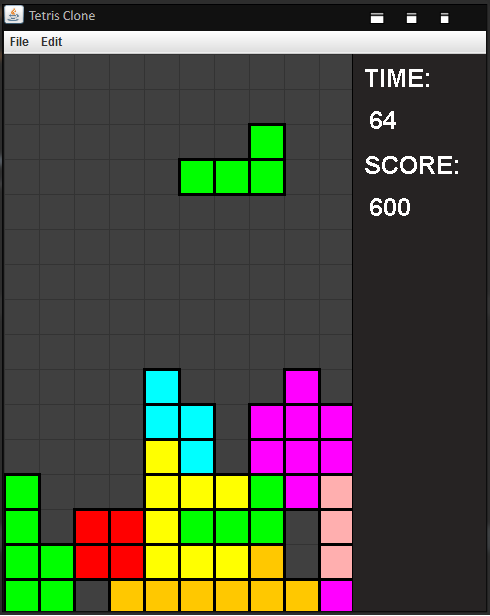

# Tetris
This is a clone of the classic Tetris game created using Java's Swing package.

### Controls:
- Arrow Keys (Down, Left, Right)
- Z & X to rotate

### Note:
- Each block's width and height is about 35px. 
- Swing frame's width and height is about 30px per unit. 
